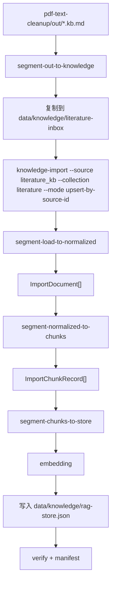

# 文献入库当前处理结构图

> 日期：2026-04-06
> 范围：`pdf-text-cleanup` 的 `out/*.kb.md` 以当前代码进入知识库时的真实处理路径
> 目的：作为后续讨论“入库方式、权重优化、upsert 改造”的固定上下文

---

## 1. 当前结论

当前文献标准入库链路已经不是“整篇原样塞库”，而是：

1. 从 `out/*.kb.md` 读取清洗后的文献稿
2. 解析 front matter 和 `kb_metadata`
3. 生成稳定 `sourceId`，优先使用 DOI
4. 按 Markdown 标题拆 section
5. 按 section 再切 chunk
6. embedding 后写入 `rag-store.json`

当前文献默认写库模式已切换为：

- `upsert-by-source-id`

这意味着：

- 同一篇文献会按 `sourceId` 进行替换
- 其他已入库文献保留不动

这已经是增量安全模式。

---

## 2. 当前主链路



---

## 3. 入口文件

文献清洗工具的标准入库入口在：

- [`03-ingest-index.ts`](/Users/tianhui/Webstart/bioagent/side-tools/pdf-text-cleanup/pyramid/segment-out-to-knowledge/03-ingest-index/03-ingest-index.ts)

这一段实际调用的是：

```bash
pnpm run knowledge-import -- run \
  --source literature_kb \
  --input <knowledgeDir> \
  --collection literature \
  --mode upsert-by-source-id
```

统一导入器入口在：

- [`knowledge-import.ts`](/Users/tianhui/Webstart/bioagent/tools/knowledge-importer/cli/knowledge-import.ts)

---

## 4. 各段真实处理

### 4.1 load -> normalized

处理文件：

- [`segment-load-to-normalized.ts`](/Users/tianhui/Webstart/bioagent/tools/knowledge-importer/pyramid/segment-load-to-normalized/segment-load-to-normalized.ts)

输入：

- `data/knowledge/literature-inbox/*.md`
- 也可直接指定 `side-tools/pdf-text-cleanup/out`

处理动作：

1. 读取每个 `*.kb.md`
2. 去掉 YAML front matter，不把 front matter 作为正文写入向量
3. 解析 `kb_metadata`
4. 尝试构建稳定 `sourceId`

`sourceId` 当前优先级：

1. `.meta.json` 里的 DOI URL / `paperId`
2. `kb_metadata.doi_url`
3. `kb_metadata.doi`
4. 正文里第一个 DOI
5. 文件名兜底

当前会抽出的重要 metadata 包括：

- `paperId`
- `sourceUrl`
- `sourceLabel`
- `doi`
- `journal`
- `published`
- `abstract`

输出对象是统一的 `ImportDocument[]`。

### 4.2 normalized -> chunks

处理文件：

- [`segment-normalized-to-chunks.ts`](/Users/tianhui/Webstart/bioagent/tools/knowledge-importer/pyramid/segment-normalized-to-chunks/segment-normalized-to-chunks.ts)

当前文献不是直接整篇切，而是分两步：

1. 先按 Markdown 标题拆 section
2. 再对每个 section 用窗口切块

当前 section 分类规则：

- `abstract`
- `introduction`
- `results`
- `discussion`
- `methods`
- `references`
- `declarations`
- `front_matter`
- `unknown`

当前 chunk 参数：

- `chunkSize: 1200`
- `overlap: 150`

chunk id 形态类似：

- `<sourceId>__s<sectionIndex>__c<chunkIndex>`

输出对象是统一的 `ImportChunkRecord[]`。

### 4.3 chunks -> store

处理文件：

- [`segment-chunks-to-store.ts`](/Users/tianhui/Webstart/bioagent/tools/knowledge-importer/pyramid/segment-chunks-to-store/segment-chunks-to-store.ts)

处理动作：

1. 把 `ImportChunkRecord` 映射成 `TextChunk`
2. 调用 embedding
3. 按指定 mode 写入 [`rag-store.json`](/Users/tianhui/Webstart/bioagent/data/knowledge/rag-store.json)
4. verify 是否已写入
5. 写入 manifest 到 `data/knowledge/import-manifests/`

当前明确会保留下来的 chunk 级字段：

- `sourceId`
- `paperId`
- `sourcePath`
- `sourceLabel`
- `sourceUrl`
- `sectionType`

---

## 5. 当前 3 种写库模式

写库逻辑在：

- [`segment-chunks-to-store.ts`](/Users/tianhui/Webstart/bioagent/tools/knowledge-importer/pyramid/segment-chunks-to-store/segment-chunks-to-store.ts)

### 5.1 `replace-collection`

含义：

- 找到这次导入涉及到的 collection
- 用这次新生成的 chunk 全量替换这些 collection

对文献来说，当前 collection 是：

- `literature`

所以当前效果就是：

- 本次导入文献集 = 新的整个 `literature`
- 旧的 `literature` 文献会被移除

### 5.2 `append`

含义：

- 直接把新 chunk 追加到现有 store 后面

风险：

- 会重复
- 同一篇论文重复入库后会出现多份 chunk

### 5.3 `upsert-by-source-id`

含义：

- 按 `collection::sourceId` 找到旧 chunk
- 只替换同一篇文献的旧 chunk
- 其他文献保留不动

这才是文献场景更合理的“增量入库”模式，也是当前默认模式。

---

## 6. 为什么你现在会在意“替换”

你的担心是对的。

旧风险来自之前如果走：

- `--collection literature --mode replace-collection`

那么以下场景都会发生旧文献消失：

1. 只导入今天新清洗的 3 篇论文
2. `literature-inbox` 里只放了一个小批次
3. 执行一次导入

结果：

- `rag-store.json` 里的 `literature` 集合只剩这次这 3 篇
- 之前已经入库但这次不在批次里的文献会从 `literature` 中消失

这也是为什么当前默认模式已经切到 `upsert-by-source-id`。

---

## 7. 当前 section 权重状态

当前代码已经做了：

- section 感知切块
- `sectionType` 存储
- `sectionPriority` 存储
- 检索侧对高优先级 section 轻量加权
- `references / declarations / 明显 pre-proof front matter` 默认不入主文献库

但还没有真正做到：

- 摘要高权重
- 结果高权重
- 讨论高权重
- 参考文献弱化
- 声明区弱化
- 方法学按场景保留或降权

也就是说，当前更像：

- “结构已识别”

还不是：

- “结构已参与检索策略”

当前 `references` 与 `declarations` 会在导入阶段直接跳过；明显的 pre-proof/front matter 也会被跳过。

---

## 8. 当前最值得改的两件事

### 8.1 文献写库模式改成 `upsert-by-source-id`

目标：

- 新论文进来时只替换同 DOI 的旧版本
- 其他论文保留

这样文献知识库才能真正增量增长。

当前已完成：

- [`03-ingest-index.ts`](/Users/tianhui/Webstart/bioagent/side-tools/pdf-text-cleanup/pyramid/segment-out-to-knowledge/03-ingest-index/03-ingest-index.ts)
- [`ingest-literature.ts`](/Users/tianhui/Webstart/bioagent/scripts/ingest-literature.ts)

### 8.2 section 差异化入库

建议优先策略：

- `abstract`: 保留，后续高权重
- `results`: 保留，后续高权重
- `discussion`: 保留，后续高权重
- `introduction`: 保留，中权重
- `methods`: 保留，但可视任务降权
- `references`: 当前默认过滤
- `declarations`: 当前默认过滤
- `front_matter`: 当前按启发式保留少量正文型前置内容，其余过滤

这一步既可以发生在入库前，也可以发生在检索排序层。

---

## 9. 一句话记忆版

当前文献入库是：

- `kb.md -> 解析元数据 -> 按章节切块 -> embedding -> 写入 literature`

但默认写法是：

- `replace-collection`

所以它当前是：

- “结构化入库”

还不是：

- “安全增量入库”

也还不是：

- “章节权重优化入库”
